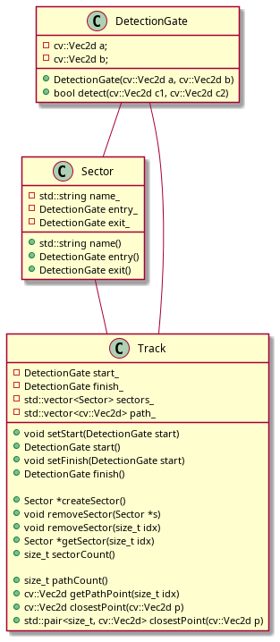
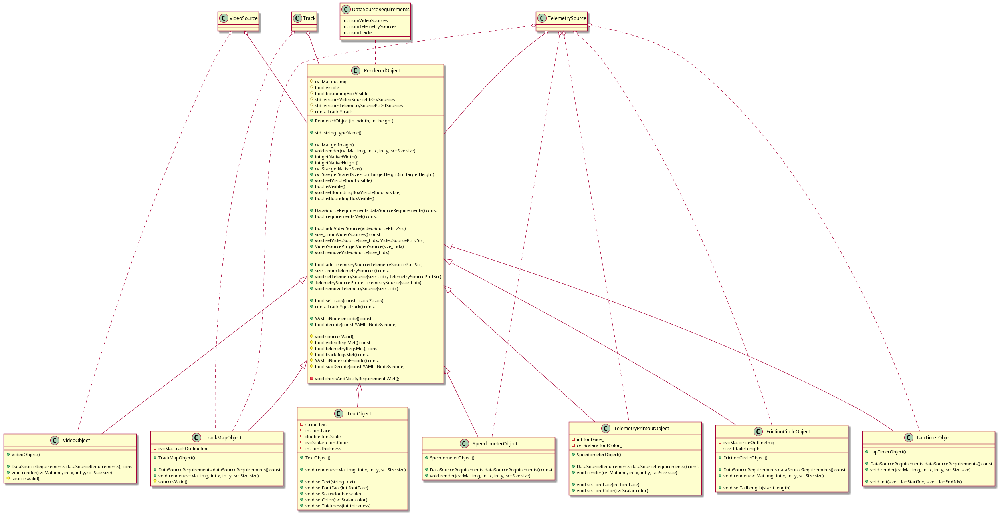
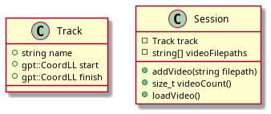

# Class Diagrams
## data Classes
<!--
@startuml plantuml_imgs/dataClasses

class TelemetrySample {
	+gpt::CombinedSample gpSamp
	+size_t lap
	+size_t sector
	+double lapTimeOffset
}

class TelemetrySeeker {
	+void next();
	+void seekToIdx(size_t idx)
	+void seekToTime(double timeOffset)
	+void seekToLap(size_t lap)
	+size_t seekedIdx()

	-size_t seekedIdx_
	-std::shared_ptr<std::vector<TelemetrySample>> samples_
}

class TelemetrySource {
	+TelemetrySource(std::shared_ptr<std::vector<CombinedSample>> samples,std::shared_ptr<TelemetrySeeker> seeker)

	+TelemetrySample at(size_t idx)
	+size_t seekedIdx()
	+size_t size()

	-std::shared_ptr<std::vector<CombinedSample>> samples_
	-std::shared_ptr<TelemetrySeeker> seeker_
}

class VideoSource {
	+VideoSource(cv::VideoCapture vc,std::shared_ptr<TelemetrySeeker> seeker)

	+cv::Mat getFrame(size_t idx)
	+size_t seekedIdx()
	+size_t frameCount()

	-cv::VideoCapture videoCapture_
	-std::shared_ptr<TelemetrySeeker> seeker_
}

class DataSource {
	+DataSource()

	+bool setDatumTrack(const Track *track, bool processNow)
	+const Track *getDatumTrack() const
	+bool reprocessDatumTrack()
	+int lapCount() const
	+bool hasTelemetry() const
	+bool hasVideo() const
	+Track *makeTrack() const

	+TelemetrySeeker seeker
	+TelemetrySource telemSrc
	+VideoSource videoSrc

	-const Track *datumTrack_
	-int lapCount_
}

class DataSourceManager {
	+DataSourceManager()

	+bool addVideo(const std::string &filepath)
	+void removeSource(size_t idx)
	+void setSourceName(size_t idx, const std::string &name)
	+size_t sourceCount() const
	+DataSourcePtr getSource(size_t idx)

	+YAML::Node encode() const
	+bool decode(const YAML::Node& node)
}

TelemetrySample *-- TelemetrySource
TelemetrySample o-- TelemetrySeeker
TelemetrySeeker o-- TelemetrySource
TelemetrySeeker o-- VideoSource

TelemetrySeeker *-- DataSource
TelemetrySource *-- DataSource
VideoSource *-- DataSource
Track o-- DataSource

DataSource *-- DataSourceManager

@enduml
-->

<!--
@startuml plantuml_imgs/dataClasses2

enum GateType_E
{
	eGT_Start,
	eGT_Finish,
	eGT_Other,
	eGT_NOT_A_GATE
}

class DetectionGate {
	+DetectionGate(cv::Vec2d a, cv::Vec2d b)

	+bool detect(cv::Vec2d c1, cv::Vec2d c2)

	-cv::Vec2d a;
	-cv::Vec2d b;
}

class TrackPathObject {
	+TrackPathObject(Track *track, std::string name)

	+Track* getTrack()
	+bool isGate()
	+bool isSector()
	+GateType_E getGateType() const
	+size_t getEntryIdx()
	+size_t getExitIdx()
	+DetectionGate getEntryGate()
	+DetectionGate getExitGate()
	+std::string getName()
	+void setName(std::string name)

	+YAML::Node encode() const
	+bool decode(const YAML::Node& node)

	#Track* track_
}

class TrackSector {
	+TrackSector(Track *track, std::string name, size_t entryIdx, size_t exitIdx)
	+TrackSector(Track *track, std::string name, size_t entryIdx, size_t exitIdx, double gateWidth_meters)

	+void setWidth(double width_meters)
	+double getWidth()
	+bool isSector()
	+void setEntryIdx(size_t pathIdx)
	+void setExitIdx(size_t pathIdx)
	+void setWidth(double width_meters)

	+YAML::Node encode() const
	+bool decode(const YAML::Node& node)

	-size_t entryIdx_
	-size_t exitIdx_
	-double gateWidth_meters_
}

class TrackGate {
	+TrackGate(Track *track, std::string name, size_t pathIdx)
	+TrackGate(Track *track, std::string name, size_t pathIdx, double gateWidth_meters)

	+void setWidth(double width_meters)
	+double getWidth()
	+bool isGate()
	+void setPathIdx(size_t pathIdx)
	+void setWidth(double width_meters)

	+YAML::Node encode() const
	+bool decode(const YAML::Node& node)

	-size_t pathIdx_
	-double gateWidth_meters_
}

class Track {
	+void setStart(size_t pathIdx)
	+const TrackGate *getStart()
	+void setFinish(size_t pathIdx)
	+const TrackGate *getFinish()

	+void addSector(std::string name, size_t entryIdx, size_t exitIdx)
	+void removeSector(size_t idx)
	+void setSectorName(size_t idx, std::string name)
	+void setSectorEntry(size_t idx, size_t entryIdx)
	+void setSectorExit(size_t idx, size_t exitIdx)
	+const TrackSector *getSector(size_t idx)
	+size_t sectorCount()

	+size_t pathCount()
	+cv::Vec2d getPathPoint(size_t idx)
	+DetectionGate getNearestDetectionGate(cv::Vec2d p, double width_meters)
	+cv::Vec2d findClosestPoint(cv::Vec2d p)
	+std::pair<cv::Vec2d, size_t> findClosestPointWithIdx(cv::Vec2d p)

	+YAML::Node encode() const
	+bool decode(const YAML::Node& node)

	-TrackGate *start_
	-TrackGate *finish_
	-std::vector<TrackSector *> sectors_
	-std::vector<cv::Vec2d> path_
}

DetectionGate .. TrackPathObject
GateType_E .. TrackPathObject
DetectionGate .. Track
TrackPathObject <|-- TrackSector
TrackPathObject <|-- TrackGate
TrackSector *-- Track
TrackGate *-- Track

@enduml
-->

## graphics Classes
<!--
@startuml plantuml_imgs/graphicsClasses

class RenderedObject {
	+cv::Mat getImage()
	+void render(cv::Mat img, int x, int y, sc::Size size)
	+int getNativeWidth()
	+int getNativeHeight()
	+cv::Size getNativeSize()
	+cv::Size getScaledSizeFromTargetHeight(int targetHeight)
	+void setVisible(bool visible)
	+bool isVisible()
	+void setBoundingBoxVisible(bool visible)
	+bool isBoundingBoxVisible()
	#cv::Mat outImg_
	#bool visible_
	#bool boundingBoxVisible_
}

class TelemetryObject {
	+void addSource(TelemetrySource tSrc)
	+TelemetrySource getSource(size_t idx)
	+size_t sourceCount()
	#std::vector<TelemetrySrouce> sources_;
}

class TextObject {
	+void setText(string text)
	+void setFontFace(int fontFace)
	+void setScale(double scale)
	+void setColor(cv::Scalar color)
	+void setThickness(int thickness)
	-string text_
	-int fontFace_
	-double fontScale_
	-cv::Scalara fontColor_
	-int fontThickness_
}

class VideoObject {
	+void setSource(VideoSource vSrc)
	+VideoSource getSource()
	#VideoSource source_;
}

class TrackMapObject {
	+void init(size_t trackStartIdx, size_t trackFinishIdx)
	+void setDotColor(size_t sourceIdx, cv::Scalar color)
	-cv::Mat trackOutlineImg_
}

class FrictionCircleObject {
	+void setTailLength(size_t length)
	-cv::Mat circleOutlineImg_
	-size_t taileLength_
}

class LapTimerObject {
	+void init(size_t lapStartIdx, size_t lapEndIdx)
}

class SpeedometerObject {
}

class TelemetryPrintoutObject {
	+void setFontFace(int fontFace)
	+void setFontColor(cv::Scalar color)
	-int fontFace_
	-cv::Scalara fontColor_
}

RenderedObject <|-- TelemetryObject
RenderedObject <|-- VideoObject
RenderedObject <|-- TextObject
TelemetryObject <|-- TrackMapObject
TelemetryObject <|-- FrictionCircleObject
TelemetryObject <|-- LapTimerObject
TelemetryObject <|-- SpeedometerObject
TelemetryObject <|-- TelemetryPrintoutObject

TelemetrySource -- TelemetryObject
VideoSource -- VideoObject

@enduml
-->

## TBD Classes
<!--
@startuml plantuml_imgs/tbdClasses

class Track {
	+string name
	+gpt::CoordLL start
	+gpt::CoordLL finish
}

class Session {
	-Track track
	-string[] videoFilepaths

	+addVideo(string filepath)
	+size_t videoCount()
	+loadVideo()
}

@enduml
-->

