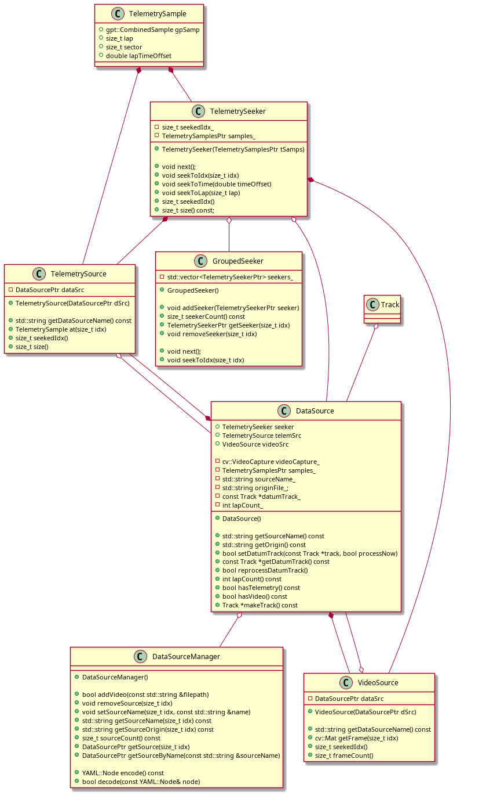
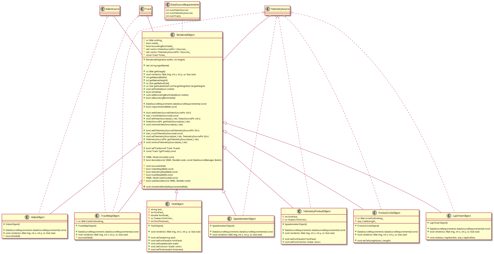
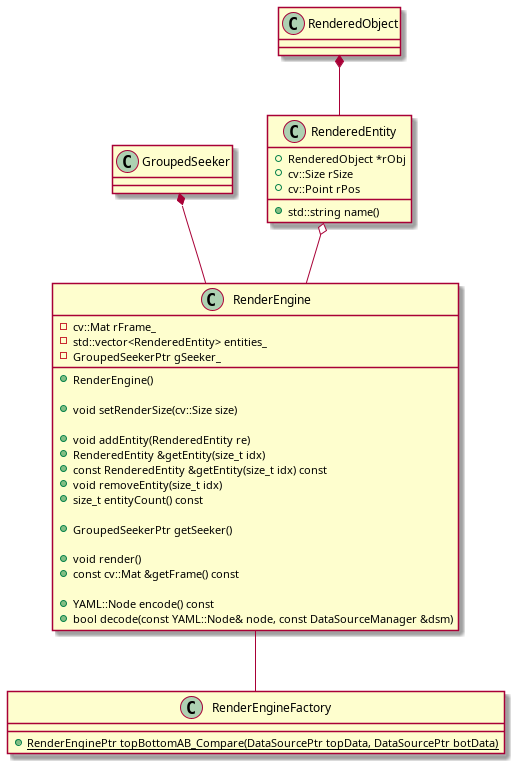

# Class Diagrams
## data Classes
<!--
@startuml plantuml_imgs/dataSourceClasses

class TelemetrySample {
	+gpt::CombinedSample gpSamp
	+size_t lap
	+size_t sector
	+double lapTimeOffset
}

class TelemetrySeeker {
	+void next();
	+void seekToIdx(size_t idx)
	+void seekToTime(double timeOffset)
	+void seekToLap(size_t lap)
	+size_t seekedIdx()

	-size_t seekedIdx_
	-std::shared_ptr<std::vector<TelemetrySample>> samples_
}

class TelemetrySource {
	+TelemetrySource(std::shared_ptr<std::vector<CombinedSample>> samples,std::shared_ptr<TelemetrySeeker> seeker, DataSourcePtr dSrc = nullptr)

	+std::string getDataSourceName() const
	+TelemetrySample at(size_t idx)
	+size_t seekedIdx()
	+size_t size()

	-DataSourcePtr dataSrc
	-std::shared_ptr<std::vector<CombinedSample>> samples_
	-std::shared_ptr<TelemetrySeeker> seeker_
}

class VideoSource {
	+VideoSource(cv::VideoCapture vc,std::shared_ptr<TelemetrySeeker> seeker, DataSourcePtr dSrc = nullptr)

	+std::string getDataSourceName() const
	+cv::Mat getFrame(size_t idx)
	+size_t seekedIdx()
	+size_t frameCount()

	-DataSourcePtr dataSrc
	-cv::VideoCapture videoCapture_
	-std::shared_ptr<TelemetrySeeker> seeker_
}

class DataSource {
	+DataSource()

	+std::string getSourceName() const
	+std::string getOrigin() const
	+bool setDatumTrack(const Track *track, bool processNow)
	+const Track *getDatumTrack() const
	+bool reprocessDatumTrack()
	+int lapCount() const
	+bool hasTelemetry() const
	+bool hasVideo() const
	+Track *makeTrack() const

	+TelemetrySeeker seeker
	+TelemetrySource telemSrc
	+VideoSource videoSrc

	-std::string sourceName_
	-std::string originFile_;
	-const Track *datumTrack_
	-int lapCount_
}

class DataSourceManager {
	+DataSourceManager()

	+bool addVideo(const std::string &filepath)
	+void removeSource(size_t idx)
	+void setSourceName(size_t idx, const std::string &name)
	+std::string getSourceName(size_t idx) const
	+std::string getSourceOrigin(size_t idx) const
	+size_t sourceCount() const
	+DataSourcePtr getSource(size_t idx)
	+DataSourcePtr getSourceByName(const std::string &sourceName)

	+YAML::Node encode() const
	+bool decode(const YAML::Node& node)
}

TelemetrySample *-- TelemetrySource
TelemetrySample *-- TelemetrySeeker
TelemetrySeeker *-- TelemetrySource
TelemetrySeeker *-- VideoSource
DataSource *-- TelemetrySource
DataSource *-- VideoSource

TelemetrySeeker o-- DataSource
TelemetrySource o-- DataSource
VideoSource o-- DataSource
Track o-- DataSource

DataSource o-- DataSourceManager

@enduml
-->

<!--
@startuml plantuml_imgs/trackDataClasses

enum GateType_E
{
	eGT_Start,
	eGT_Finish,
	eGT_Other,
	eGT_NOT_A_GATE
}

class DetectionGate {
	+DetectionGate(cv::Vec2d a, cv::Vec2d b)

	+bool detect(cv::Vec2d c1, cv::Vec2d c2)

	-cv::Vec2d a;
	-cv::Vec2d b;
}

class TrackPathObject {
	+TrackPathObject(Track *track, std::string name)

	+Track* getTrack()
	+bool isGate()
	+bool isSector()
	+GateType_E getGateType() const
	+size_t getEntryIdx()
	+size_t getExitIdx()
	+DetectionGate getEntryGate()
	+DetectionGate getExitGate()
	+std::string getName()
	+void setName(std::string name)

	+YAML::Node encode() const
	+bool decode(const YAML::Node& node)

	#Track* track_
}

class TrackSector {
	+TrackSector(Track *track, std::string name, size_t entryIdx, size_t exitIdx)
	+TrackSector(Track *track, std::string name, size_t entryIdx, size_t exitIdx, double gateWidth_meters)

	+void setWidth(double width_meters)
	+double getWidth()
	+bool isSector()
	+void setEntryIdx(size_t pathIdx)
	+void setExitIdx(size_t pathIdx)
	+void setWidth(double width_meters)

	+YAML::Node encode() const
	+bool decode(const YAML::Node& node)

	-size_t entryIdx_
	-size_t exitIdx_
	-double gateWidth_meters_
}

class TrackGate {
	+TrackGate(Track *track, std::string name, size_t pathIdx)
	+TrackGate(Track *track, std::string name, size_t pathIdx, double gateWidth_meters)

	+void setWidth(double width_meters)
	+double getWidth()
	+bool isGate()
	+void setPathIdx(size_t pathIdx)
	+void setWidth(double width_meters)

	+YAML::Node encode() const
	+bool decode(const YAML::Node& node)

	-size_t pathIdx_
	-double gateWidth_meters_
}

class Track {
	+void setStart(size_t pathIdx)
	+const TrackGate *getStart()
	+void setFinish(size_t pathIdx)
	+const TrackGate *getFinish()

	+void addSector(std::string name, size_t entryIdx, size_t exitIdx)
	+void removeSector(size_t idx)
	+void setSectorName(size_t idx, std::string name)
	+void setSectorEntry(size_t idx, size_t entryIdx)
	+void setSectorExit(size_t idx, size_t exitIdx)
	+const TrackSector *getSector(size_t idx)
	+size_t sectorCount()

	+size_t pathCount()
	+cv::Vec2d getPathPoint(size_t idx)
	+DetectionGate getNearestDetectionGate(cv::Vec2d p, double width_meters)
	+cv::Vec2d findClosestPoint(cv::Vec2d p)
	+std::pair<cv::Vec2d, size_t> findClosestPointWithIdx(cv::Vec2d p)

	+YAML::Node encode() const
	+bool decode(const YAML::Node& node)

	-TrackGate *start_
	-TrackGate *finish_
	-std::vector<TrackSector *> sectors_
	-std::vector<cv::Vec2d> path_
}

DetectionGate .. TrackPathObject
GateType_E .. TrackPathObject
DetectionGate .. Track
TrackPathObject <|-- TrackSector
TrackPathObject <|-- TrackGate
TrackSector *-- Track
TrackGate *-- Track

@enduml
-->

## project Classes
<!--
@startuml plantuml_imgs/projectClasses

class RenderProject {
	+RenderProject()

	+DataSourceManager &dataSourceManager()
	+void setTrack(Track *track)
	+Track *getTrack()
	+bool hasTrack() const

	+bool save(const std::string &filepath)
	+bool load(const std::string &filepath)

	+YAML::Node encode() const
	+bool decode(const YAML::Node& node)

	-DataSourceManager dsm_
	-Track *track_
}

DataSourceManager *-- RenderProject
Track *-- RenderProject

@enduml
-->

## graphics Classes
<!--
@startuml plantuml_imgs/graphicsClasses

class DataSourceRequirements {
	int numVideoSources
	int numTelemetrySources
	int numTracks
}

class RenderedObject {
	+RenderedObject(int width, int height)

	+std::string typeName()

	+cv::Mat getImage()
	+void render(cv::Mat img, int x, int y, sc::Size size)
	+int getNativeWidth()
	+int getNativeHeight()
	+cv::Size getNativeSize()
	+cv::Size getScaledSizeFromTargetHeight(int targetHeight)
	+void setVisible(bool visible)
	+bool isVisible()
	+void setBoundingBoxVisible(bool visible)
	+bool isBoundingBoxVisible()

	+DataSourceRequirements dataSourceRequirements() const
	+bool requirementsMet() const

	+bool addVideoSource(VideoSourcePtr vSrc)
	+size_t numVideoSources() const
	+void setVideoSource(size_t idx, VideoSourcePtr vSrc)
	+VideoSourcePtr getVideoSource(size_t idx)
	+void removeVideoSource(size_t idx)

	+bool addTelemetrySource(TelemetrySourcePtr tSrc)
	+size_t numTelemetrySources() const
	+void setTelemetrySource(size_t idx, TelemetrySourcePtr tSrc)
	+TelemetrySourcePtr getTelemetrySource(size_t idx)
	+void removeTelemetrySource(size_t idx)

	+bool setTrack(const Track *track)
	+const Track *getTrack() const

	+YAML::Node encode() const
	+bool decode(const YAML::Node& node)

	#void sourcesValid()
	#bool videoReqsMet() const
	#bool telemetryReqsMet() const
	#bool trackReqsMet() const
	#YAML::Node subEncode() const
	#bool subDecode(const YAML::Node& node)

	-void checkAndNotifyRequirementsMet();

	#cv::Mat outImg_
	#bool visible_
	#bool boundingBoxVisible_
	#std::vector<VideoSourcePtr> vSources_
	#std::vector<TelemetrySourcePtr> tSources_
	#const Track *track_
}

class TextObject {
	+TextObject()

	+void render(cv::Mat img, int x, int y, sc::Size size)

	+void setText(string text)
	+void setFontFace(int fontFace)
	+void setScale(double scale)
	+void setColor(cv::Scalar color)
	+void setThickness(int thickness)

	-string text_
	-int fontFace_
	-double fontScale_
	-cv::Scalara fontColor_
	-int fontThickness_
}

class VideoObject {
	+VideoObject()

	+DataSourceRequirements dataSourceRequirements() const
	+void render(cv::Mat img, int x, int y, sc::Size size)
	#sourcesValid()
}

class TrackMapObject {
	+TrackMapObject()

	+DataSourceRequirements dataSourceRequirements() const
	+void render(cv::Mat img, int x, int y, sc::Size size)
	#sourcesValid()

	-cv::Mat trackOutlineImg_
}

class FrictionCircleObject {
	+FrictionCircleObject()

	+DataSourceRequirements dataSourceRequirements() const
	+void render(cv::Mat img, int x, int y, sc::Size size)

	+void setTailLength(size_t length)

	-cv::Mat circleOutlineImg_
	-size_t taileLength_
}

class LapTimerObject {
	+LapTimerObject()

	+DataSourceRequirements dataSourceRequirements() const
	+void render(cv::Mat img, int x, int y, sc::Size size)

	+void init(size_t lapStartIdx, size_t lapEndIdx)
}

class SpeedometerObject {
	+SpeedometerObject()

	+DataSourceRequirements dataSourceRequirements() const
	+void render(cv::Mat img, int x, int y, sc::Size size)
}

class TelemetryPrintoutObject {
	+SpeedometerObject()

	+DataSourceRequirements dataSourceRequirements() const
	+void render(cv::Mat img, int x, int y, sc::Size size)

	+void setFontFace(int fontFace)
	+void setFontColor(cv::Scalar color)
	-int fontFace_
	-cv::Scalara fontColor_
}

DataSourceRequirements .. RenderedObject

RenderedObject <|-- VideoObject
RenderedObject <|-- TextObject
RenderedObject <|-- TrackMapObject
RenderedObject <|-- FrictionCircleObject
RenderedObject <|-- LapTimerObject
RenderedObject <|-- SpeedometerObject
RenderedObject <|-- TelemetryPrintoutObject

VideoSource o-- RenderedObject
TelemetrySource o-- RenderedObject
Track o-- RenderedObject

VideoSource o.. VideoObject
Track o.. TrackMapObject
TelemetrySource o.. TrackMapObject
TelemetrySource o.. FrictionCircleObject
TelemetrySource o.. LapTimerObject
TelemetrySource o.. SpeedometerObject
TelemetrySource o.. TelemetryPrintoutObject

@enduml
-->

## Render Engine Classes
<!--
@startuml plantuml_imgs/renderEngineClasses

class RenderedEntity {
	+RenderedObject *rObj
	+cv::Size rSize
	+cv::Point rPos
}

class RenderEngine {
	+RenderEngine()

	+void setRenderSize(cv::Size size)

	+void addEntity(RenderedEntity re)
	+RenderedEntity &getEntity(size_t idx)
	+const RenderedEntity &getEntity(size_t idx) const
	+void removeEntity(size_t idx)

	+void render()
	+const cv::Mat &getFrame() const

	+YAML::Node encode() const
	+bool decode(const YAML::Node& node)

	-cv::Mat rFrame_
	-std::vector<RenderedEntity> entities_
}

RenderedObject *-- RenderedEntity
RenderedEntity o-- RenderEngine

@enduml
-->
